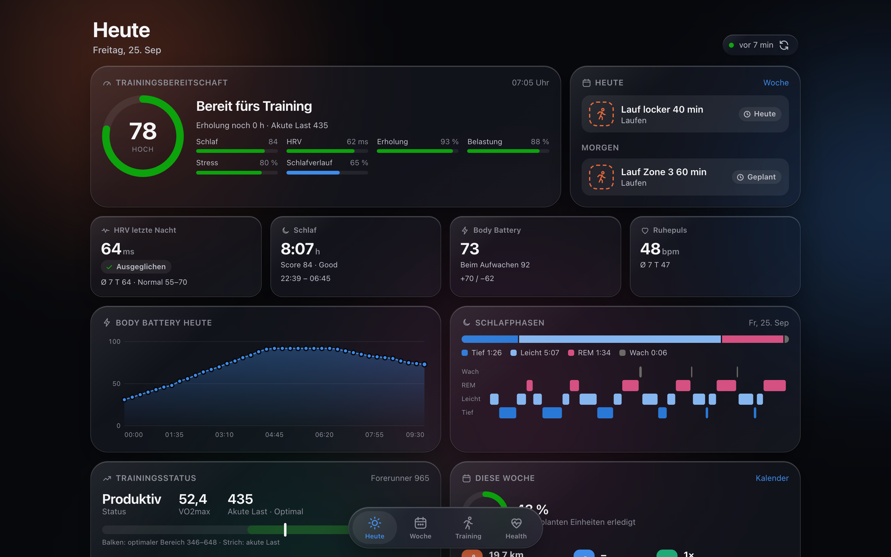
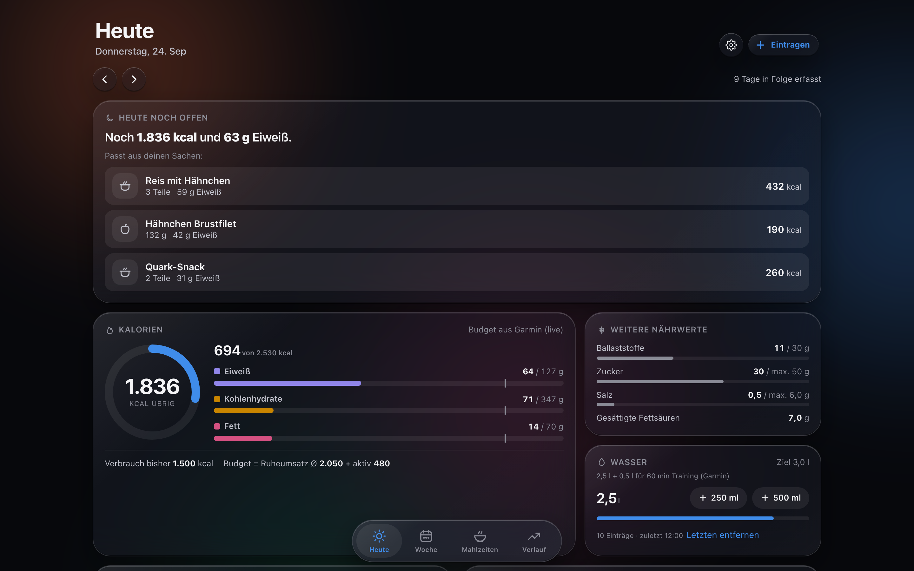
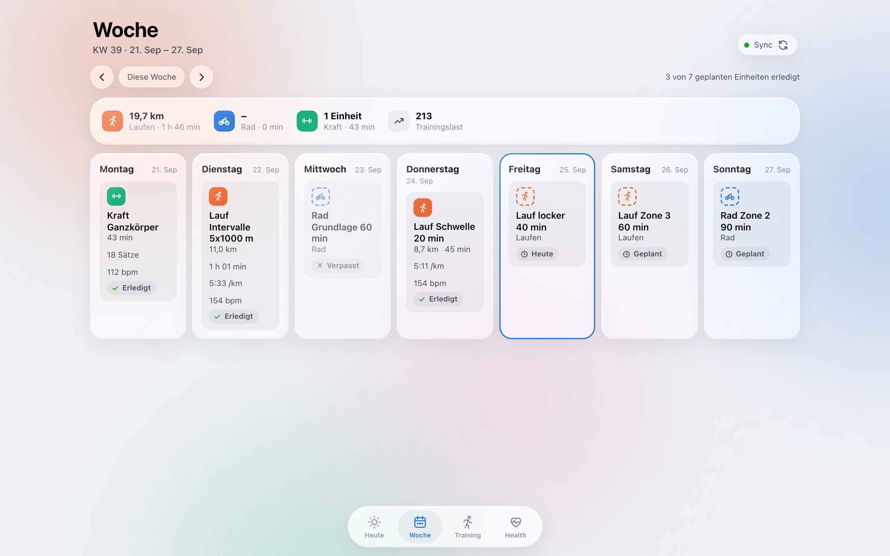
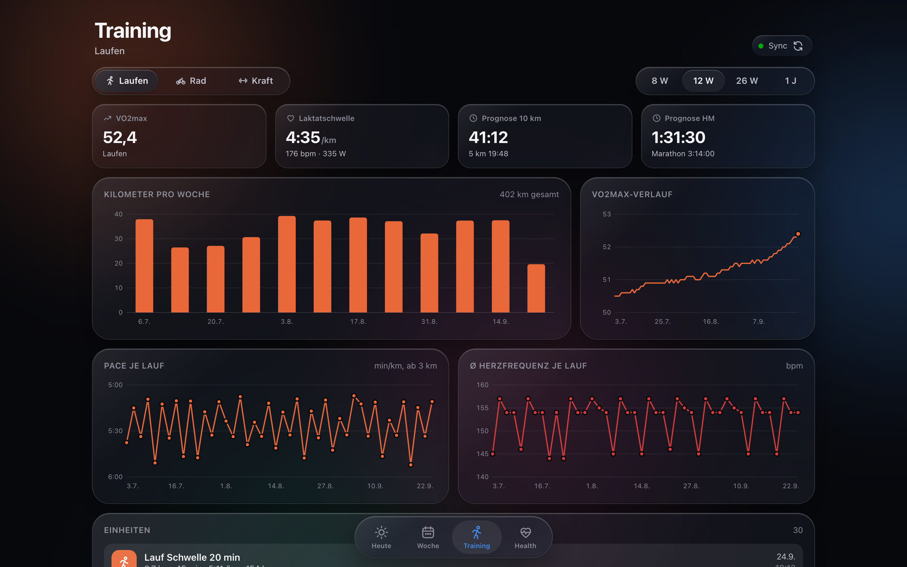
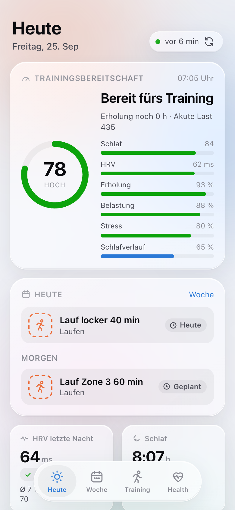
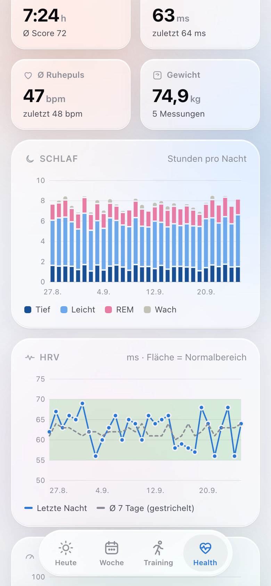
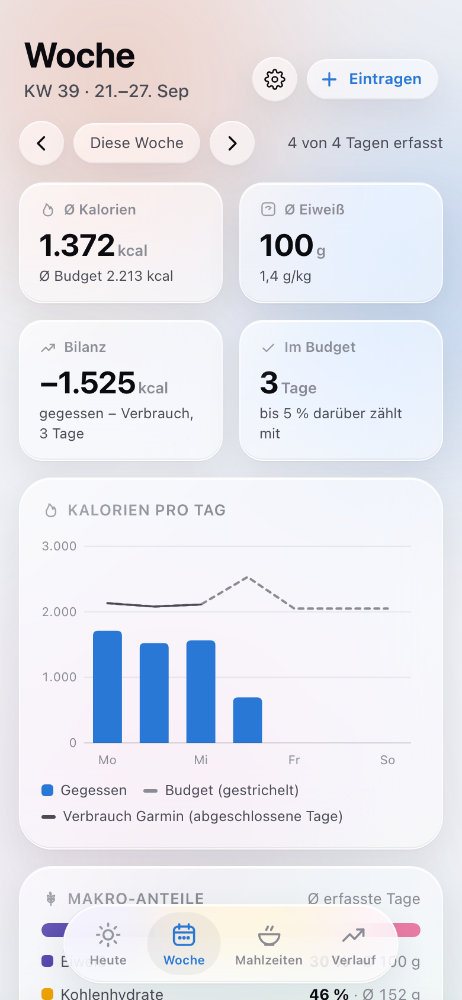
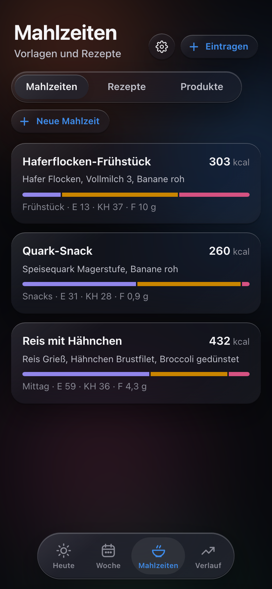
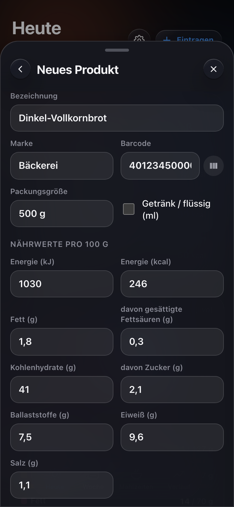
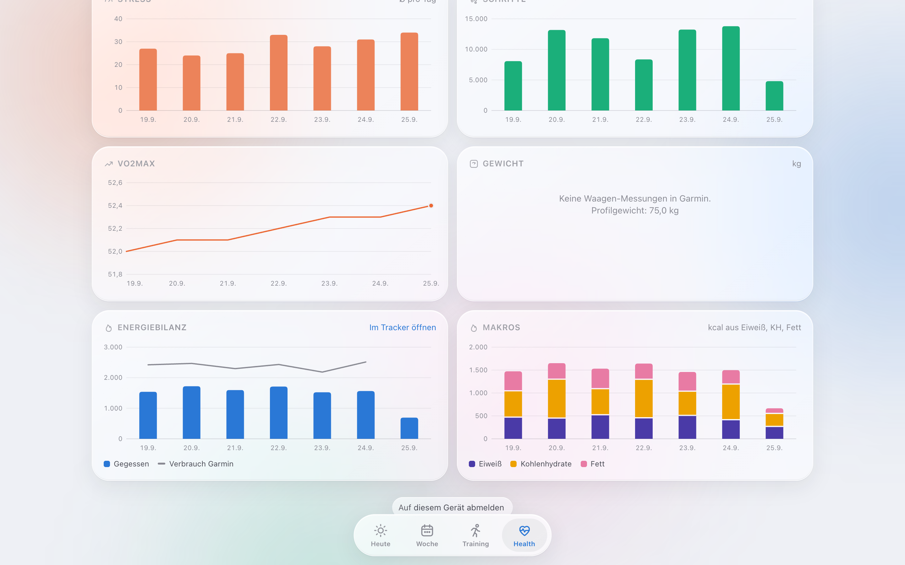

# Training-Dashboard & Kalorien-Tracker

Zwei selbst gehostete Web-Apps (PWA) für den Raspberry Pi, im gleichen „Liquid Glass“-Design:

- **Training-Dashboard:** deine **Garmin**-Daten übersichtlicher als in Garmin Connect. Dazu gehören Trainingsbereitschaft, Schlaf und HRV, ein Wochenkalender mit Soll/Ist sowie Laufen, Rad und Kraft.
- **Kalorien-Tracker:** Ernährungstagebuch mit deutscher Lebensmitteldatenbank und Barcode-Scanner. Das Tagesbudget ergibt sich aus dem Garmin-Verbrauch.

Beide laufen komplett im Heimnetz, ohne Cloud und ohne Konto bei einem Anbieter. Sie funktionieren einzeln. Zusammen ergänzen sie sich zu einer **Energiebilanz**: gegessen vs. verbraucht.

| Training-Dashboard | Kalorien-Tracker |
|:---:|:---:|
|  |  |
| [Mehr zum Dashboard ↓](#training-dashboard) | [Mehr zum Tracker ↓](#kalorien-tracker) |

> Alle Screenshots zeigen **erfundene Demodaten** (siehe [Ausprobieren](#ausprobieren-lokal-mit-demodaten)).

## Inhalt des Repositorys

| Ordner | Inhalt |
|---|---|
| [`garmin-dashboard/`](garmin-dashboard/) | Training-Dashboard (FastAPI + SQLite + Vanilla JS). Holt die Garmin-Daten selbstständig und schonend. |
| [`kalorien-tracker/`](kalorien-tracker/) | Kalorien-Tracker (FastAPI + SQLite + Vanilla JS). Läuft auch ohne Dashboard. |
| [`https-proxy/`](https-proxy/) | Caddy als HTTPS-Proxy mit Zertifikat aus einer lokalen CA (mkcert). Nötig für die Kamera (Barcode) auf dem iPhone. |
| [`garmin-dashboard/docs/DESIGN-SYSTEM.md`](garmin-dashboard/docs/DESIGN-SYSTEM.md) | Das gemeinsame Design: Farben, Glas-Material, Komponenten, Diagramm-Regeln |
| [`docs/SETUP.md`](docs/SETUP.md) | **Schritt-für-Schritt-Anleitung** zum Einrichten auf dem Pi |

---

## Training-Dashboard

<p align="center">
  
  
  
  
</p>

**Heute**
- Trainingsbereitschaft als Ring, darunter alle Faktoren: Schlaf, HRV, Erholung, Belastung, Stress
- HRV der letzten Nacht mit Normalbereich, Schlaf mit Phasen und Hypnogramm, Body Battery im Tagesverlauf, Ruhepuls
- Trainingsstatus mit akuter Last im optimalen Bereich und Belastungsfokus der letzten 4 Wochen
- Die geplante Einheit für heute und morgen, dazu der Wochenfortschritt und die Energiebilanz aus dem Tracker

**Woche:** Kalender mit den geplanten Workouts aus Garmin Connect, automatisch abgeglichen mit den absolvierten Einheiten. Jede Einheit ist markiert als *erledigt*, *verpasst*, *heute*, *geplant* oder *zusätzlich*. Dazu die Wochensummen je Sportart.

**Training** (Laufen · Rad · Kraft, 8 Wochen bis 1 Jahr)
- **Laufen:** VO2max, Laktatschwelle, Wettkampfprognosen, Kilometer pro Woche, Pace und Puls je Lauf
- **Rad:** FTP und W/kg, Leistungszonen, Stunden pro Woche, Normalized Power je Fahrt
- **Kraft:** Einheiten, Sätze und Volumen (Gewicht × Wiederholungen)
- **Detailansicht jeder Einheit:** Strecke, Herzfrequenz, Pace bzw. Leistung, Höhe, Zeit in Zonen, Runden, Kraft-Sätze

**Health** (7 Tage bis 1 Jahr): Schlaf, HRV mit Normalbereich, Trainingsbereitschaft, Ruhepuls, Trainingslast, Body Battery, Stress, Schritte, VO2max, Gewicht. Ist der Tracker angebunden, kommen Energiebilanz und Makros dazu.

**Schonender Garmin-Sync.** Garmin hat keine offene API für Privatpersonen, deshalb nutzt das Dashboard die inoffizielle Bibliothek `garminconnect`:
- Alle Aufrufe sind gedrosselt, bei Rate-Limits wartet der Sync exponentiell länger.
- Abgeschlossene Tage werden nie erneut abgerufen.
- Details einer Einheit lädt er genau einmal.
- Morgens fragt er häufiger nach, bis die Schlafdaten da sind, nachts selten.
- Die Historie (1 Jahr) lädt er in kleinen Portionen im Hintergrund nach.
- Die App liest immer aus dem lokalen SQLite-Cache und ist dadurch sofort da.

<p align="center">
  
  
</p>
<p align="center">
  
  
</p>

---

## Kalorien-Tracker

<p align="center">
  
  
  
  
</p>

**Eintragen**
- Suche während der Eingabe über ~240.000 Lebensmittel, komplett lokal (SQLite FTS5 mit Trigram-Index, < 50 ms auf dem Pi).
  Grundnahrungsmittel kommen vor Markenprodukten, oft Gegessenes und Favoriten steigen nach oben.
- Barcode-Scan mit der Kamera: auf dem iPhone über [zxing-wasm](https://github.com/Sec-ant/zxing-wasm) (lokal eingebunden), sonst über `BarcodeDetector`.
- Mengen in g/ml, Stück oder Portion. Mehrere Lebensmittel lassen sich nacheinander eintragen, ohne das Fenster zu schließen.
- „Nur kcal“-Schnelleintrag, „Wie gestern“ pro Mahlzeit, Rückgängig statt Rückfragen.
- **Neues Produkt erfassen**, wenn etwas fehlt: Das Formular ist aufgebaut wie die Nährwerttabelle auf der Packung (kJ ↔ kcal, Plausibilitätsprüfung).
  Mit Barcode wird das Produkt beim nächsten Scan sofort erkannt. Falsche Werte aus Open Food Facts lassen sich lokal korrigieren.

**Planen**
- Gespeicherte **Mahlzeiten** (z. B. „Mein Frühstück“): Ein Tipp trägt alle Teile ein, die Mengen sind vorher anpassbar.
- **Rezepte**: Zutaten und Gewicht nach dem Kochen ergeben die Nährwerte pro 100 g und pro Portion.

**Auswerten**
- Tagesring „übrig / drüber“, Makros (Eiweiß, Kohlenhydrate, Fett) mit Zielen, dazu Zucker, Ballaststoffe, Salz und Wasser.
- Woche und Verlauf (30 Tage bis 1 Jahr): Kalorien vs. Budget, Energiebilanz, Eiweiß, Makro-Anteile, Serie.
- Ab 17 Uhr erscheint ein Hinweis wie „Noch 600 kcal und 40 g Eiweiß“, mit passenden Vorschlägen aus den eigenen Mahlzeiten und Favoriten.

<p align="center">
  
  
  
  
</p>

---

## Zusammenspiel

<p align="center"></p>

- **Tracker → Dashboard:** Im Dashboard stehen „gegessen vs. verbraucht“ und die Makros direkt neben den Trainingsdaten, mit Link zurück in den Tracker.
- **Dashboard → Tracker:** Das Tagesbudget ist der Ruheumsatz (Ø 7 Tage) plus die heutigen Aktivkalorien ± Ziel. Es wächst also nach dem Training.
  Auch das Wasserziel wächst mit der Trainingszeit, das getrunkene Wasser wird zusätzlich in Garmin Connect eingetragen.

```
                 ┌──────────────── Docker-Netz homelab-apps (172.30.0.0/24) ───────────────┐
iPhone / Mac ──► │ https-proxy (Caddy, :4320/:4311) ──► kalorien-tracker ◄──► garmin-dashboard │ ──► Garmin Connect
  (Heimnetz      │                 172.30.0.10           tracker.db            garmin.db       │
   oder VPN)     │                                       captured.db                           │
                 │                                       bls.db, off.db                        │
                 └──────────────────────────────────────────────────────────────────────────────┘
```

- Die Apps sprechen **Server zu Server** über einen geteilten Token (`INTERNAL_TOKEN`), nie über den Browser.
  `/internal/*` ist nur mit Token **und** nur aus dem Docker-Netz erreichbar, der Proxy blockt es zusätzlich.
- Fällt eine Seite aus, läuft die andere weiter und zeigt `–`.

**Gemeinsame Technik**
- Kein Build-Schritt, keine Frameworks im Frontend, eigene SVG-Diagramme mit Tooltips. Hell und dunkel, Handy und Desktop, als App auf dem Home-Bildschirm installierbar.
- Passwort-Login (scrypt, signiertes Session-Cookie, Sperre nach Fehlversuchen) und strenge Content-Security-Policy.
- Docker Compose, zusammen unter 150 MB RAM auf einem Raspberry Pi 4/5.

## Ausprobieren (lokal, mit Demodaten)

Beide Apps bringen ein Skript für **erfundene** Beispieldaten mit. Dafür brauchst du weder ein Garmin-Konto noch einen Pi.

**Training-Dashboard**

```bash
git clone https://github.com/<dein-name>/<repo>.git && cd <repo>/garmin-dashboard
python3.12 -m venv .venv && ./.venv/bin/pip install -r requirements.txt
mkdir -p data/demo
DATA_DIR=./data/demo ./.venv/bin/python scripts/demo_data.py       # 120 Tage Training, Schlaf, HRV …
DATA_DIR=./data/demo SYNC_ENABLED=0 AUTH_ENABLED=0 ./.venv/bin/python -m uvicorn app.main:app --port 4310
```

→ http://localhost:4310

**Kalorien-Tracker**

```bash
cd <repo>/kalorien-tracker
python3.12 -m venv .venv && ./.venv/bin/pip install -r requirements.txt
mkdir -p data/demo
DATA_DIR=./data/demo ./.venv/bin/python -m app.import_bls          # BLS laden (~25 s)
DATA_DIR=./data/demo ./.venv/bin/python scripts/demo_data.py       # 14 Tage Beispieldaten
DATA_DIR=./data/demo AUTH_ENABLED=0 ./.venv/bin/python -m uvicorn app.main:app --port 4320
```

→ http://localhost:4320

<details>
<summary><b>Beide verbunden starten</b> (Energiebilanz im Dashboard, Garmin-Budget im Tracker)</summary>

Lokal laufen beide über die IPv6-Loopback-Adresse `::1`, damit die interne Schnittstelle wie im Docker-Netz geschützt bleibt:

```bash
# Terminal 1 – Dashboard
cd garmin-dashboard
DATA_DIR=./data/demo SYNC_ENABLED=0 AUTH_ENABLED=0 INTERNAL_TOKEN=demo INTERNAL_NET=::1/128 PROXY_IP=::9 \
  TRACKER_URL=http://[::1]:4320 TRACKER_PUBLIC_URL=http://[::1]:4320 \
  ./.venv/bin/python -m uvicorn app.main:app --host ::1 --port 4310

# Terminal 2 – Tracker
cd kalorien-tracker
DATA_DIR=./data/demo AUTH_ENABLED=0 INTERNAL_TOKEN=demo INTERNAL_NET=::1/128 PROXY_IP=::9 \
  DASHBOARD_URL=http://[::1]:4310 \
  ./.venv/bin/python -m uvicorn app.main:app --host ::1 --port 4320
```

Dann http://[::1]:4310 öffnen.
</details>

Die komplette Einrichtung auf einem Raspberry Pi mit HTTPS, Login, Markenprodukten und Garmin-Anbindung steht in **[docs/SETUP.md](docs/SETUP.md)**.

## Datenquellen und Lizenzen

Die Lebensmitteldaten sind **nicht** im Repository. Sie werden beim Einrichten heruntergeladen:

| Quelle | Inhalt | Lizenz |
|---|---|---|
| [Bundeslebensmittelschlüssel (BLS) 4.0](https://www.blsdb.de) | 7.140 Grundnahrungsmittel, laborgeprüft | CC BY 4.0 – Max Rubner-Institut (2025): Bundeslebensmittelschlüssel (BLS), Version 4.0 – Deutsche Nährstoffdatenbank. Karlsruhe. |
| [Open Food Facts](https://world.openfoodfacts.org) | ~234.000 Markenprodukte aus Deutschland (gefiltert, siehe [kalorien-tracker/README.md](kalorien-tracker/README.md#produktdaten)) | Datenbank: ODbL, Inhalte: DbCL, Bilder: CC BY-SA |
| [zxing-wasm](https://github.com/Sec-ant/zxing-wasm) (in `web/vendor/`) | Barcode-Erkennung | MIT |

Die Namensnennung erscheint in der App unter *Verlauf → Datenquellen & Info*.
Die Garmin-Anbindung nutzt die inoffizielle Bibliothek [`garminconnect`](https://github.com/cyberjunky/python-garminconnect).
Sie kann jederzeit durch Änderungen bei Garmin brechen. Garmin ist eine Marke der Garmin Ltd., dieses Projekt steht in keiner Verbindung zu Garmin.

## Hinweise

- Persönliches Projekt mit deutschsprachiger Oberfläche. Es ist keine medizinische oder ernährungswissenschaftliche Beratung,
  Budget und Makroziele sind Richtwerte.
- Gedacht fürs Heimnetz (von unterwegs per VPN). Nicht ungeschützt ins Internet stellen.

## Lizenz

Code: [MIT](LICENSE). Für die Daten gelten die Lizenzen der jeweiligen Quellen (siehe oben).
