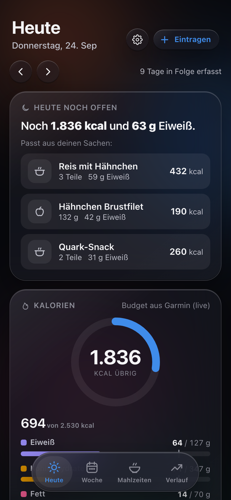
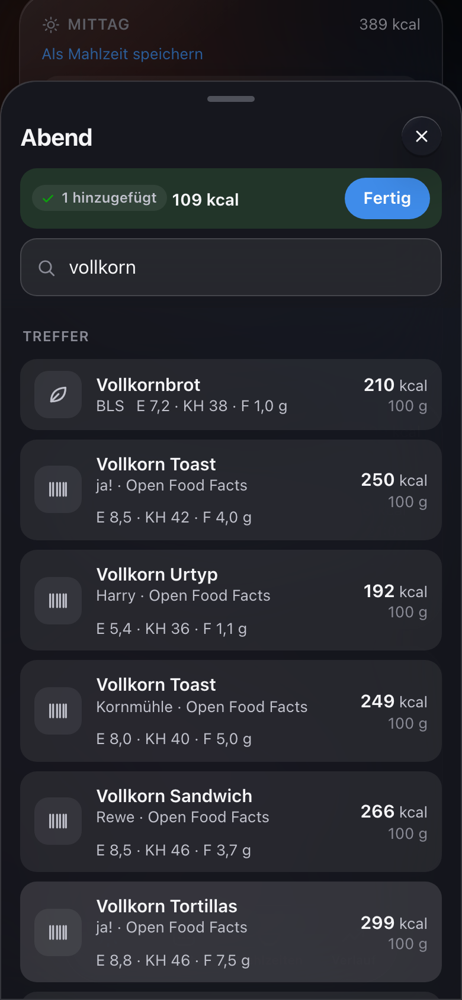
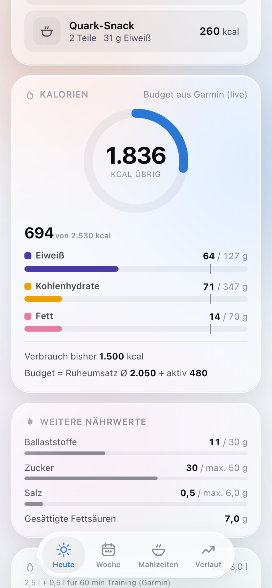
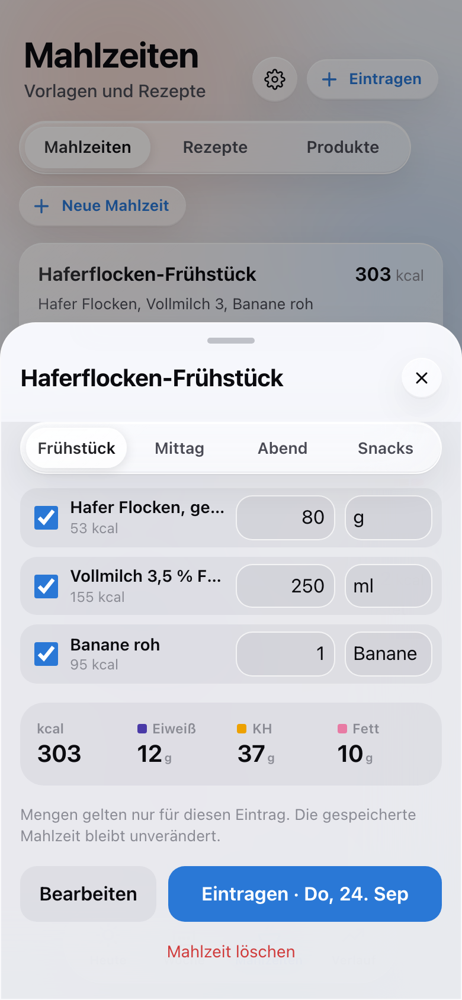
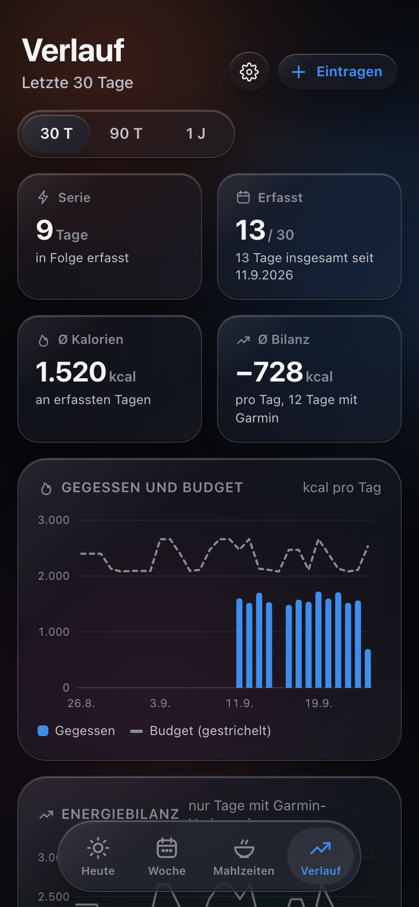

# Kalorien-Tracker & Training-Dashboard

Selbst gehosteter Kalorien-Tracker als Web-App (PWA) für den Raspberry Pi – mit deutscher
Lebensmitteldatenbank, Barcode-Scanner, Tagesbudget aus dem **Garmin**-Verbrauch und einem
passenden Training-Dashboard. Läuft komplett im Heimnetz, ohne Cloud, ohne Konto bei einem Anbieter.

<p align="center">
  
  
  
  
</p>

<p align="center"></p>

## Was drin ist

| Ordner | Inhalt |
|---|---|
| [`kalorien-tracker/`](kalorien-tracker/) | Die Tracker-App (FastAPI + SQLite + Vanilla JS). Läuft auch allein. |
| [`garmin-dashboard/`](garmin-dashboard/) | Optionales Training-Dashboard für Garmin-Daten. Liefert dem Tracker den Kalorienverbrauch und bekommt „gegessen vs. verbraucht“ zurück. |
| [`https-proxy/`](https-proxy/) | Caddy als HTTPS-Proxy mit Zertifikat aus einer lokalen CA (mkcert). Nötig für die Kamera (Barcode) auf dem iPhone. |
| [`docs/SETUP.md`](docs/SETUP.md) | **Schritt-für-Schritt-Anleitung** zum Einrichten |

## Funktionen

**Eintragen**
- Suche während der Eingabe über ~240.000 Lebensmittel, komplett lokal (SQLite FTS5 mit Trigram-Index, < 50 ms auf dem Pi).
  Grundnahrungsmittel kommen vor Markenprodukten, oft Gegessenes und Favoriten steigen nach oben.
- Barcode-Scan mit der Kamera – auf dem iPhone über [zxing-wasm](https://github.com/Sec-ant/zxing-wasm) (lokal eingebunden), sonst `BarcodeDetector`.
- Mengen in g/ml, Stück oder Portion. Mehrere Lebensmittel nacheinander, ohne das Fenster zu schließen.
- „Nur kcal“-Schnelleintrag, „Wie gestern“ pro Mahlzeit, Rückgängig statt Rückfragen.
- **Neues Produkt erfassen**, wenn etwas fehlt: Formular wie die Nährwerttabelle auf der Packung
  (kJ ↔ kcal, Plausibilitätsprüfung). Mit Barcode wird es beim nächsten Scan sofort erkannt.
  Falsche Werte aus Open Food Facts lassen sich lokal korrigieren.

**Planen**
- Gespeicherte **Mahlzeiten** (z. B. „Mein Frühstück“) – ein Tipp trägt alle Teile ein, Mengen vorher anpassbar.
  Am schnellsten per „Als Mahlzeit speichern“ direkt aus einem Tag.
- **Rezepte**: Zutaten + Gewicht nach dem Kochen → Nährwerte pro 100 g und pro Portion.

**Auswerten**
- Tagesring „übrig / drüber“, Makros (Eiweiß, Kohlenhydrate, Fett) mit Zielen, Zucker, Ballaststoffe, Salz, Wasser.
- Woche und Verlauf (30 Tage bis 1 Jahr): Kalorien vs. Budget, Energiebilanz, Eiweiß, Makro-Anteile, Serie.
- Ab 17 Uhr: „Noch 600 kcal und 40 g Eiweiß“ mit passenden Vorschlägen aus den eigenen Mahlzeiten und Favoriten.

**Mit Garmin (optional, über das Dashboard)**
- Tagesbudget = Ruheumsatz (Ø 7 Tage) + heutige Aktivkalorien ± Ziel – wächst nach dem Training.
- Wasserziel wächst mit der Trainingszeit; Wasser wird in **Garmin Connect** mit eingetragen.
- Das Dashboard zeigt „gegessen vs. verbraucht“ und Makros neben den Trainingsdaten.

**Technik**
- Kein Build-Schritt, keine Frameworks im Frontend, eigene SVG-Diagramme. Hell und dunkel, Handy und Desktop.
- Passwort-Login (scrypt, signiertes Session-Cookie, Sperre nach Fehlversuchen), strenge Content-Security-Policy.
- Läuft mit ~60 MB RAM auf einem Raspberry Pi 4/5. Docker Compose.

<p align="center">
  
  
  
  
</p>

## Schnellstart (nur ansehen, lokal mit Demodaten)

```bash
git clone https://github.com/<dein-name>/<repo>.git && cd <repo>/kalorien-tracker
python3.12 -m venv .venv && ./.venv/bin/pip install -r requirements.txt
mkdir -p data/demo
DATA_DIR=./data/demo ./.venv/bin/python -m app.import_bls          # BLS laden (~25 s)
DATA_DIR=./data/demo ./.venv/bin/python scripts/demo_data.py       # 14 Tage Beispieldaten
DATA_DIR=./data/demo AUTH_ENABLED=0 ./.venv/bin/python -m uvicorn app.main:app --port 4320
```

Dann http://localhost:4320 öffnen. Die komplette Einrichtung auf einem Raspberry Pi (HTTPS, Login,
Markenprodukte, Garmin) steht in **[docs/SETUP.md](docs/SETUP.md)**.

## Architektur

```
                 ┌──────────────── Docker-Netz homelab-apps (172.30.0.0/24) ───────────────┐
iPhone / Mac ──► │ https-proxy (Caddy, :4320/:4311) ──► kalorien-tracker ◄──► garmin-dashboard │ ──► Garmin Connect
  (Heimnetz      │                 172.30.0.10           tracker.db            garmin.db       │
   oder VPN)     │                                       captured.db                           │
                 │                                       bls.db, off.db                        │
                 └──────────────────────────────────────────────────────────────────────────────┘
```

- Tracker und Dashboard sprechen **Server zu Server** über einen geteilten Token (`INTERNAL_TOKEN`), nie über den Browser.
  `/internal/*` ist nur mit Token **und** nur aus dem Docker-Netz erreichbar; der Proxy blockt es zusätzlich.
- Fällt eine Seite aus, läuft die andere weiter und zeigt `–`.

## Datenquellen und Lizenzen

Die Lebensmitteldaten sind **nicht** im Repository. Sie werden beim Einrichten heruntergeladen:

| Quelle | Inhalt | Lizenz |
|---|---|---|
| [Bundeslebensmittelschlüssel (BLS) 4.0](https://www.blsdb.de) | 7.140 Grundnahrungsmittel, laborgeprüft | CC BY 4.0 – Max Rubner-Institut (2025): Bundeslebensmittelschlüssel (BLS), Version 4.0 – Deutsche Nährstoffdatenbank. Karlsruhe. |
| [Open Food Facts](https://world.openfoodfacts.org) | ~234.000 Markenprodukte aus Deutschland (gefiltert, siehe [kalorien-tracker/README.md](kalorien-tracker/README.md#produktdaten)) | Datenbank: ODbL, Inhalte: DbCL, Bilder: CC BY-SA |
| [zxing-wasm](https://github.com/Sec-ant/zxing-wasm) (in `web/vendor/`) | Barcode-Erkennung | MIT |

Die Namensnennung erscheint in der App unter *Verlauf → Datenquellen & Info*.
Die Garmin-Anbindung nutzt die inoffizielle Bibliothek [`garminconnect`](https://github.com/cyberjunky/python-garminconnect);
sie kann jederzeit durch Änderungen bei Garmin brechen.

## Hinweise

- Persönliches Projekt, deutschsprachige Oberfläche. Keine medizinische oder ernährungswissenschaftliche Beratung –
  Budget und Makroziele sind Richtwerte.
- Gedacht fürs Heimnetz (von unterwegs per VPN). Nicht ungeschützt ins Internet stellen.

## Lizenz

Code: [MIT](LICENSE). Für die Daten gelten die Lizenzen der jeweiligen Quellen (siehe oben).
