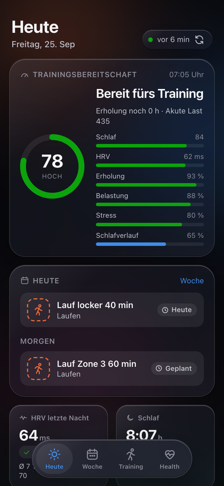
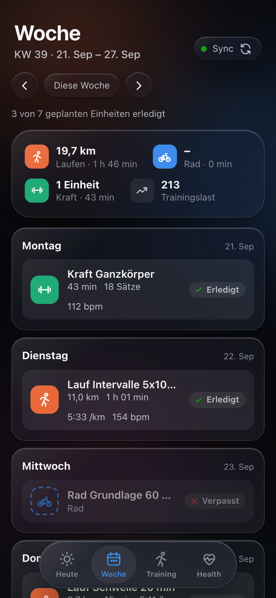
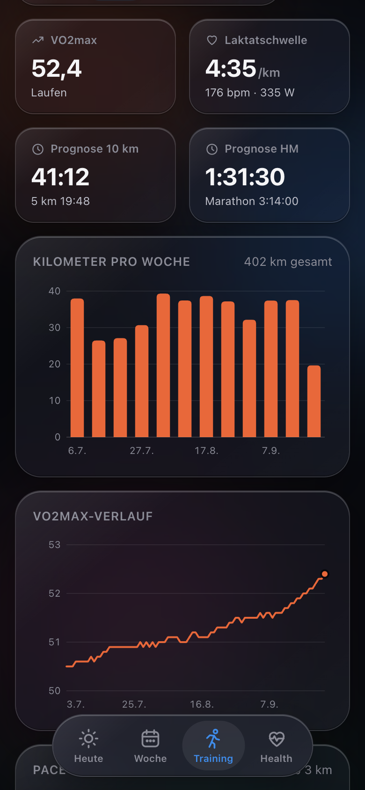
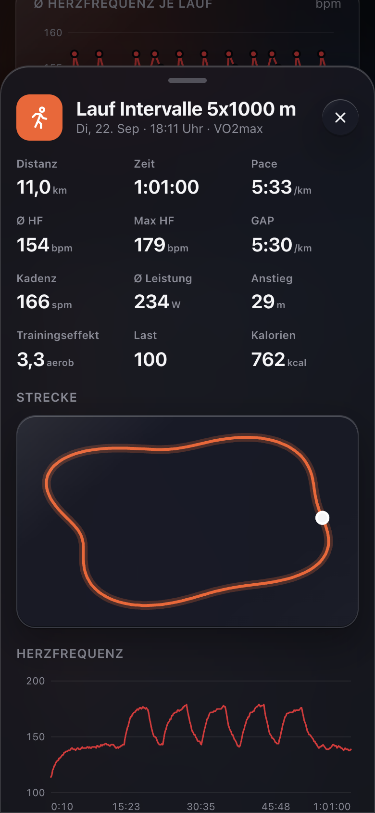

# Training Dashboard

Persoenliches Garmin-Dashboard im Liquid-Glass-Stil. Laeuft als installierbare
Web-App auf dem Raspberry Pi im Heimnetz, von unterwegs ueber den WireGuard-VPN der Fritzbox.

**URL:** http://raspberrypi.local:4310 (alternativ http://192.168.1.50:4310)
**HTTPS:** https://raspberrypi.local:4311 ueber den Caddy-Proxy (`../https-proxy`, lokale CA)

<p align="center">
  
  
  
  
</p>

(Screenshots mit erfundenen Demodaten.)

## Ausprobieren mit Demodaten

Ohne Garmin-Konto, mit 120 Tagen erfundener Trainings- und Gesundheitsdaten:

```bash
python3.12 -m venv .venv && ./.venv/bin/pip install -r requirements.txt
mkdir -p data/demo
DATA_DIR=./data/demo ./.venv/bin/python scripts/demo_data.py
DATA_DIR=./data/demo SYNC_ENABLED=0 AUTH_ENABLED=0 ./.venv/bin/python -m uvicorn app.main:app --port 4310
```

Die README-Screenshots entstehen mit `scripts/screenshots.py` (Playwright + Google Chrome) aus genau diesen Daten.

## Aufbau

```
Garmin Connect ──► Sync-Thread (garminconnect) ──► SQLite (data/garmin.db)
                                                   │
Mac (Heimnetz) / iPhone (WireGuard-VPN der Fritzbox) ──► raspberrypi:4310 ──► Passwort-Login ──► FastAPI + PWA
```

| Pfad | Inhalt |
|---|---|
| `app/sync.py` | Intelligenter Sync (Intervalle, Backoff, Historie) |
| `app/db.py` | SQLite-Cache, Rohdaten als JSON |
| `app/views.py` | Aufbereitung pro Screen (liest nur SQLite) |
| `app/main.py` | API, Login-Pruefung, Security-Header |
| `app/auth.py` | Passwort (scrypt-Hash), signierte Session-Cookies, Sperre bei Fehlversuchen |
| `app/login.py` | Einmaliger Garmin-Login (interaktiv) |
| `app/nutrition.py` | Verbindung zum Kalorien-Tracker (`/internal`, Energiebilanz) |
| `web/` | Frontend ohne Build-Schritt: `app.js`, `styles.css`, Service Worker, Icons |

## Sync-Logik

- Alle Garmin-Aufrufe laufen gedrosselt (1,5 s Abstand). Bei 429 oder Auth-Fehlern
  wartet der Sync exponentiell laenger (15 min bis 4 h).
- Abgeschlossene Tage (aelter als gestern) sind `final` und werden nie neu geholt.
- **Heute** (Schlaf, HRV, Readiness, Body Battery, Status): morgens alle 10 min, bis
  die Nacht da ist, danach alle 30 min, nachts alle 2 h.
- **Aktivitaeten**: Liste alle 10 min (nachts 60). Details (Splits, Zeitreihen,
  GPS, Zonen, Kraft-Saetze) genau einmal pro neuer Aktivitaet. Eine neue Einheit
  loest sofort ein Update von Readiness und Trainingsstatus aus.
- **Kalender**: Vormonat, aktueller und naechster Monat alle 30 min.
- **Historie**: 365 Tage Aktivitaeten + Trends und 90 Tage Tageswerte werden in
  kleinen Portionen im Hintergrund nachgeladen.
- Der Sync-Button im UI stoesst einen Sync an (hoechstens 1x pro Minute).

## Sicherheit

- Erreichbar nur im Heimnetz. An der Fritzbox gibt es **kein** Port-Forwarding;
  von unterwegs geht es nur ueber den WireGuard-VPN.
- Jede Seite und jeder API-Aufruf braucht einen Login. Gespeichert wird nur ein
  scrypt-Hash des Passworts (`data/auth.json`, 0600). Die Session ist ein
  HMAC-signiertes, HttpOnly-Cookie (SameSite=Strict) und gilt ein Jahr.
- Nach 5 Fehlversuchen in 15 min wird die IP gesperrt. Jeder Fehlversuch dauert mindestens 1 s.
- Ein neues Passwort meldet alle Geraete ab.
- Auf 4310 ist die Verbindung HTTP (im WLAN schuetzt WPA, unterwegs WireGuard); auf 4311 HTTPS ueber den Proxy.
- Garmin-Tokens liegen in `data/tokens` (Rechte 0600). Das Garmin-Passwort wird nie gespeichert.

## Kalorien-Tracker

Das Dashboard ist mit dem Kalorien-Tracker (`../kalorien-tracker`) verbunden. Beide Container haengen
im Docker-Netz `homelab-apps` und sprechen Server zu Server mit einem geteilten Token (`INTERNAL_TOKEN`
in `.env`, Rechte 0600, gleicher Wert wie im Tracker):

- `GET /internal/v1/energy?date=YYYY-MM-DD` (oder `from`/`to`) → `{totalKcal, activeKcal, bmrKcal, final}`
  aus `daily.summary` fuer das Tagesbudget im Tracker.
- Das Dashboard holt `GET /internal/v1/summary` vom Tracker (60 s Cache) und zeigt auf **Heute** die
  Karte *Energiebilanz* (gegessen = `--accent`, Verbrauch = `--ink-3`, Makros) und im **Health**-Tab
  die Diagramme *Energiebilanz* und *Makros*.
- `/internal/*` nur mit Token und nur aus dem Docker-Netz; von Host, LAN und Proxy kommt 403/404.
  Ist der Tracker nicht erreichbar, zeigt das Dashboard `–`.

## Betrieb auf dem Pi

```bash
# Deploy vom Mac
rsync -a --exclude .venv --exclude data --exclude __pycache__ --exclude .claude --exclude .env ./ pi@raspberrypi.local:garmin-dashboard/
ssh pi@raspberrypi.local 'cd ~/garmin-dashboard && docker compose up -d --build'

# Logs
ssh pi@raspberrypi.local 'cd ~/garmin-dashboard && docker compose logs -f --tail 50'

# Dashboard-Passwort setzen/aendern (meldet alle Geraete ab)
ssh -t pi@raspberrypi.local 'cd ~/garmin-dashboard && docker compose run --rm garmin-dashboard python -m app.auth'

# Eigener Garmin-Login fuer den Pi (fragt E-Mail, Passwort, MFA)
ssh -t pi@raspberrypi.local 'cd ~/garmin-dashboard && docker compose run --rm garmin-dashboard python -m app.login'
```

## Lokal entwickeln

```bash
/usr/local/bin/python3.12 -m venv --copies .venv && ./.venv/bin/pip install -r requirements.txt
GARMINTOKENS=~/.garminconnect ./.venv/bin/python -m uvicorn app.main:app --port 4310   # mit Sync
SYNC_ENABLED=0 AUTH_ENABLED=0 ./.venv/bin/python -m uvicorn app.main:app --port 4310   # nur UI, ohne Login
```

## Farben

Die Sportfarben (Laufen Orange, Rad Blau, Kraft Gruen) sind mit dem
Palette-Validator geprueft: CVD-Abstand fuer alle Paare >= 9, in hellem und
dunklem Modus. Statusfarben (erledigt/verpasst) erscheinen nie ohne Icon + Text.
